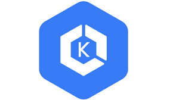
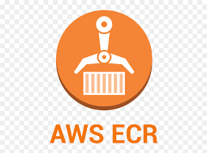

## 🚀 Automated GitOps Workflow in Action

Welcome to the core of our GitOps project, where automation takes center stage. This section offers an in-depth exploration of the mechanics of our automated GitOps workflow and introduces the pivotal roles played by key components.

### 🧰 Key Components

| Component                | Role                                                   | Description                                                  |
|--------------------------|--------------------------------------------------------|--------------------------------------------------------------|
| | **Terragrunt** |Designs and provisions AWS resources, ensuring infrastructure aligns seamlessly with code.        |
|  | **GitHub Actions** | Responsible for building Docker images automatically whenever code changes are pushed. |
|| **Amazon Elastic Kubernetes Service (EKS)** | Compose application blueprints, dictating every aspect of deployment configuration. |
|| **Amazon Elastic Container Registry (ECR)** |  Amazon EKS is our Kubernetes cluster manager. It efficiently manages and scales Kubernetes clusters, ensuring a robust and highly available environment for deploying containerized applications. |
|  | **Argo CD** | Monitors ECR for new images and directs their deployment to the Kubernetes cluster using Helm charts. |
|  | **Helm Charts** | Compose application blueprints, dictating every aspect of deployment configuration. |

### 📜 Configuration Details

To gain an in-depth understanding of how each component operates and how to configure them to suit your specific requirements, please refer to the dedicated documentation available in their respective folders:

| Component                | Configuration Documentation Folder |
|--------------------------|-----------------------------------|
| **Terragrunt** | [Terragrunt folder](link-to-terragrunt) |
| **ECR** | [ECR folder](link-to-ecr) |
| **Argo CD** | [Argo CD folder](link-to-argo-cd) |
| **Helm Charts** | [Helm Charts folder](link-to-helm-charts) |

### 🚀 The Result?

This meticulously synchronized orchestration ensures that your infrastructure and applications remain in perfect alignment with your code. Updates and deployments unfold seamlessly, promising a reliable and impressive experience for your users.

Let's examine the tangible outcomes of this orchestrated automation:

1. **Efficiency**: Automation ensures your infrastructure and applications are always up-to-date, reducing manual effort and potential errors.

2. **Reliability**: Consistency in provisioning and deployment leads to fewer errors and a highly dependable environment.

3. **Scalability**: Easily scale your resources and deployments to meet evolving demands.

4. **Reduced Workload**: Automation minimizes manual intervention, lightening the workload for your team.

5. **Enhanced User Satisfaction**: End-users experience a stable and responsive platform, fostering satisfaction and trust.
